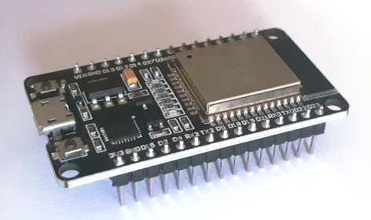
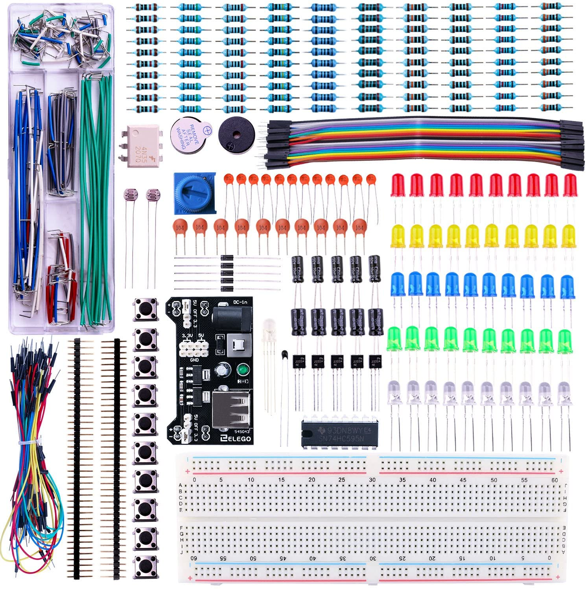
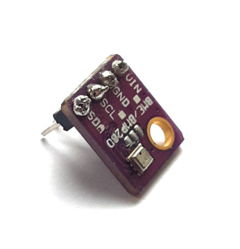
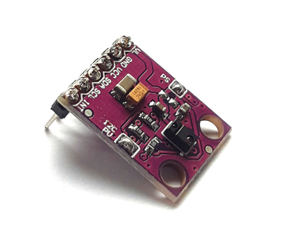
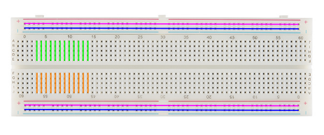

# Micropython on an ESP32 Microcontroller

Hopefully what you have in front of you are the following parts:
1.  An Espressif ESP32, with [MicroPython](https://micropython.org/) v1.13 installed:

    

2. Electronics kit (from ELEGOO - full details on their [website](https://www.elegoo.com/products/elegoo-electronics-fun-kits-4-versions)):

    

3. A Bosch BME280 temperature, humidity and pressure sensor:

    

4. An Avago Technologies APDS-9960 gesture sensor - can sense proximity, light, colour (RGB) and gestures:

    

5. A USB cable (with micro plug on one end).

The ESP32 allows you to run a (fairly comprehensive) subset of Python 3 code on the microcontroller. It also gives you direct access to the GPIO pins on the sides of the ESP32, which measn you can read from sensors or switches or slight LEDs, make noise with a buzzer etc. etc.

The ESP32 can be connected to your laptop using the USB cable. You can access the Read Evaluate Print Loop (REPL) of Micropython over this connection - details of how to get access to this are on the [setup](./pages/setup.md) page. The Micropython REPL is just like the prompt in iPython or the prompt you can get to when you type python on the command line (it's actually essentially identical to the python prompt). The big difference is that the code you type runs on the ESP32, **not** on your laptop.

## How to use these pages
1. Start off at the [Setup page](./pages/setup.md).

    For the first parts, you only need to follow through the section [Connecting via Serial](./pages/setup.md#setup-serial)

2. Have a look at [A Simple Circuit](./pages/simple_circuit.md).

3. To do more advanced things, we need to set up VSCode to work with the ESP32 - have a look at the [Setup VSCode section of setup](./pages/setup.md#setup-vscode)

4. Next can write more complicated programs, which don't require input from us to run (necessarily). Getting started with this is covered on the  [Project page](./pages/project.md). *This bit is work in progress!*

### What can you do with this?
As a first step, I've written enough instructions to enable you to make a traffic light that you can start by calling typing a command at the REPL. Where we go after that is up to you. Here are some ideas:
- Start the traffic light by pressing a button on the breadboard.
- Start the traffic light via a webpage.
- Report temperature/pressure/humidity to the REPL.
    - Extending this, we could make a webpage with constantly updating temperature.
- Do *something* with the APDS-9960 (I've not experimented with it much so far, so I don't know what it can do...).

## Notes on the Breadboard
The breadboard consists of a series of holes arranged in a grid pattern. A wire or the leg of an electronic component can be pushed into each hole. Electrcal contacts run underneath the board which the legs/wires make contact with to build up electronic circuits.

Considering the rows and columns, the board can be divided into four parts:
- Two outermost columns on each side (pink and blue lines in the picture)
- The 10 inner columns, divided in half by the central groove (some highlighted, in green and orange)

    

The outermost sides of the board have two lines of contacts which run up and down the length of the board (the two columns on the side). These provide a voltage supply (+) and a ground (-) which can be connected as you want to the rows in the middle.

In the inner region, each row has one contact which runs across the row. The middle groove breaks the rows in two (i.e. the contact does not run across he groove).

The idea of the groove is you can use it to include chips in your circuit without bridging between the legs of the chip (the chips are mounted in so called Dual In-line Packages - DIPs; there are two of these included in the electronics kit). The groove is also a good place to mount push-buttons.

A fairly comprehensive rundown of using a breadboard - including a bit of history - is available from [SparkFun](https://learn.sparkfun.com/tutorials/how-to-use-a-breadboard/all).

A [Breadboard Power Supply Module](https://components101.com/modules/5v-mb102-breadboard-power-supply-module) is also included in the electronics kit. If you have a mains transformer which supplies 6.5-12V (see the label on the transformer; anything in this range is fine) and which will fit the round socket on the module, you can power both sides of your board using this. 
- **Be careful where the power goes with regard to the ESP32!**
- **Set the jumpers on either side of the module to 3.3V unless you need 5V for something to avoid damage!**

## More Detailed Information - For Reference
Numbering from the numbered list above:

2. The ELEGOO Electronics Kit comes with an [Arduino focussed PDF](./pages/resources/getting_started/Electronics%20Fun%20Kit%20V1.0.19.03.25.pdf), which might be interesting as there's some ideas of simple circuits you can try out.
    
    Just remember the code in the PDF is written for Arduino and not MicroPython, so it won't work on the ESP32 as is!
    - As well as the PDF there are also a whole load of datasheets, which might be helpful. Everything is included in a [Zip file](./pages/resources/getting_started/Elegoo%20Electronics%20Fun%20Kit%20V1.0.19.09.10.zip).

3. The BME280 has lots of resources for using this with Arduino (e.g. from [SparkFun](https://learn.sparkfun.com/tutorials/sparkfun-bme280-breakout-hookup-guide/all)).

    I've used this with Arduino myself. I've soldered the pins already and tested the board so that should be ok. These BME280s connect through an I2C bus.
    
    There are a few libraries available for connecting it up to MicroPython:
    - https://randomnerdtutorials.com/micropython-bme280-esp32-esp8266/
    - https://github.com/robert-hh/BME280
    - https://github.com/neliogodoi/MicroPython-BME280

4. The APDS-9960 also has a few resources for Arduino (e.g. again from [SparkFun](https://learn.sparkfun.com/tutorials/apds-9960-rgb-and-gesture-sensor-hookup-guide/all)).

    Again, I've soldered the pins onto the board and tested the board with an Arduino, so it should work. Like the BME280, these boards connect through the I2C bus.

    Libraries for using these boards with MicroPython are a little rarer, but I found a couple which look promising:
    - https://github.com/liske/python-apds9960
    - https://github.com/GuyCarver/MicroPython/blob/master/lib/APDS9960.py

    This isn't helpful directly, but it's an interesting write-up on how to analyse the device: https://github.com/rm-hull/apds9960