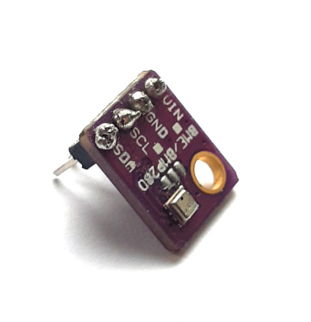

# BME280 Temperature, Pressure & Humidity Sensor & python
The BME280 sensor is capable of measuring temperature, pressure and humidity. The sensor communicates with the computer (be that a Raspberry Pi or a microcontroller running micropython) using the I<sup>2</sup>C (Inter-Integrated Circuit) protocol. Sparkfun provides a [detailed description of I<sup>2</sup>C](https://learn.sparkfun.com/tutorials/i2c/all) if you are interested (something for a rainy afternoon...!). To use this on the Raspberry Pi it must be enabled using *raspi-config*.

In addition the sensor can tell you what (relative) altitude the sensor is at, calculated based on a known pressure and the one which the sensor currently reads. This might be useful, for example, for a drone, where the pressure at groundlevel can be measured and stored before it starts its flight and this measurement then used to calculate how the drone's altitude changes over its flight.

## Let's have a look at the hardware...
The BME280 has four pins on it labelled **VIN** (Voltage IN - **important: 3.3V**!), **GND** (GrouND), **SCL** (Serial CLock) and **SDA** (Serial DAta).

 

These same pins are also available on the Raspberry Pi. The figure below shows the GPIO pins of the Raspberry Pi 3 and 4 (an iteractive version with lots more resources is available at https://pinout.xyz):

]

The Raspberry Pi 1 & 2 had only 26 pins and so has a different layout for its GPIO pins:

]

On both versions of the board, we are interested only in pins 1 (3.3V), 2 (SDA), 3 (SCL) and 5 (Ground). These are on the end of the board furthest from the USB sockets, and on the inside of the board. If in doubt, have a look at   https://pinout.xyz.

### Wiring up the BME280
We've identified the pins we're interested in and the wiring couldn't be simpler:
1. VIN on the BME280 goes to pin 1 (3V3) on the Raspberry Pi.
2. GND on the BME280 goes to pin 5 (ground) on the Pi.
3. SCL on the BME280 goes to pin 3 (SCL) on the Pi.
4. SDA on the BME280 goes to pin 2 (SDA) on the Pi.

> **Caution:** Do not wire up the BME280 when the Pi is switched on. Connecting the BME280 to a powered up Pi can damage either the Pi or the sensor.

## Setting up the Raspberry Pi
> If you've already used I<sup>2</sup>C devices on the Raspberry Pi you're working on, you can skip this section 

Once the Raspberry Pi has started up, open a terminal and type the following command:
```bash
$ sudo raspi-config
```
From the *raspi-config* main menu, select *Interface Options* by moving the cursor up and down the menu and then pressing \<enter\>:

[raspi-config main menu](./resources/python-pi-sensors/raspi-config_mainmenu.png)

In the Interface Options menu, select I2C:

[raspi-config interface options](./resources/python-pi-sensors/raspi-config_interfaceoptions.png)

You will then be asked if you want to enable I2C. You do, so select **YES**. *raspi-config* returns to the main menu and you can now select *Finish* (n.b. you will need to use the left and right arrow keys to get to *Finish*). If prompted to restart, select yes. Once the Pi has started up again, you can use I2C to talk to sensor.

## Writing a python script
First of all, as always, consider making a *python virtual environment* for working on your project. Details of how to do this are on the [python Projects page](./python-proj.md).

To control the BME280 sensor, we need to download a library using pip. We're going to the use [the one provided by adafruit](https://learn.adafruit.com/adafruit-bme280-humidity-barometric-pressure-temperature-sensor-breakout/python-circuitpython-test#python-installation-of-bme280-library-2995297) since I've used this before and it works. There are plenty of other libraries available too however...

> The following assume that you are already working in a virtual environment (i.e. you have run `source venv/bin/activate` (Raspberry Pi/Linux) or  `venv\Scripts\activate` (Windows)) 

- if you are not you may have to replace `pip` in the commands with `pip3`. It may also be necessary to use the `sudo` command (i.e. `sudo pip3...`), but if that is  necessary, I would **strongly** recommend using a virtual environment.

```bash
(venv) $ pip install adafruit-circuitpython-bme280
```

This pulls in a number of other packages, including the RPi.GPIO package, which allows us to access the GPIO pins in python.

As a simple example, the following code prints the current temperature to the commandline:
```python
import board
import busio
from adafruit_bme280 import basic as adafruit_bme280    # 1

i2c = busio.I2C(board.SCL, board.SDA)    # 2
bme280 = adafruit_bme280.Adafruit_BME280_I2C(i2c, 0x76)    # 3
temp = bme280.temperature    # 4
print("Temperature: " + str(temp))

```
Some explanation, line by line:
1. The `adafruit_bme280` library doesn't import as nicely as most other libraries. The `from adafruit_bme280 import basic` part imports the `basic` module from `adafruit_bme280`. The `as adafruit_bme280` part allows us to interact with `basic` using the name `adafruit_bme280`. The idea of this is to make the code more readable
2. `i2c = busio.I2C(board.SCL, board.SDA)` creates an object in python which gives access to the I<sup>2</sup>C bus on the python, using the pins defined by the board for **SCL** and **SDA**.
3. `bme280 = adafruit_bme280.Adafruit_BME280_I2C(i2c, 0x76)` creates an object representing our BME280 sensor in python using the adafruit library. We tell the library to use the `i2c` object we created in (2) to communicate with the BME280. We also tell it that the address of the sensor is `0x76` (the library is set up for a sensor with I<sup>2</sup>C address `0x77`, so its important we tell it the correct address).
4. Read the temperature. Remember temperatures are reported as `floats`. If we want to print the temperature along with a string, we need to convert it to a string (we do this on the line below: `str(temp)`).

As well as temperature, the `adafruit-circuitpython-bme280` allows you to read the humidity and the pressure. The commands, using the same names as the sample above, look like this:
* `sensor.pressure`
* `sensor.humidity`
* `sensor.altitude` - this assumes sea level pressure of 1013.25 mBar and uses this to determine the altitude.
