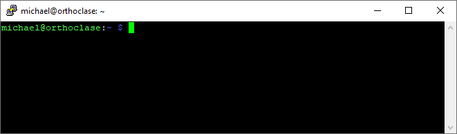
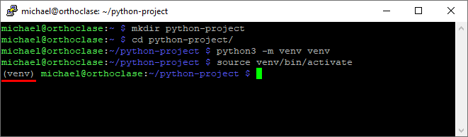
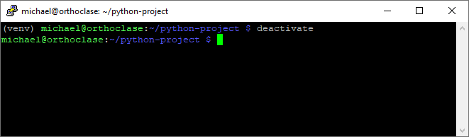

# python Projects

## Setting Up a New Python Project with Virtual Environment

When writing your own software project it is helpful to keep the code organised in its own directory. This keeps the code from one project separate from others projects you might be working on. You can also put all the other resources for a project (e.g. webpages, pictures, sounds effects or supporting libraries) into sub-directories inside this project so that everything is together.

We'll go through the process of creating a new project here using a Raspberry Pi. The same process applies to making a new project using either Windows or another Linux based system. First get a ssh connection or if you have the Pi connected directly to a keyboard and monitor, open a terminal:



1. You can create your project either directly in your user's home directory (`~` on Linux) or move to another directory using the `cd` command first.
2. Create a new directory with the following command - the directory should have the name of your project:
   ```bash
   mkdir python-project
   cd python-project
   ```

python takes the idea of separation once step further with *virtual environment*s, or *venv*. A *virtual environment* is a python installation completely separate from the main one on your computer. It is installed in a separate directory inside the project directory, usually called `venv`.

3. Inside your project directory, issue the following command:
   ```bash
   python3 -m venv venv
   ```
   - This tells python to call the module venv (`-m venv`) with the argument `venv`. The argument is the name of the directory that will be created. If you give a different argument, remember to change the following commands in this guide appropriately.

Once created you have to *activate* the virtual environment, which replaces the paths to the system python with the paths to the virtual environment. The virtual environment is only activated inside the terminal Window you're currently using, so if you open a new one or close the one with the activated virtual environment, you will need to run this activate command again:

4. Activate the newly created python virtual environment:
   * Raspberry Pi/Linux:
      ```bash
      source venv/bin/activate
      ```
    * Windows:
      ```powershell
      .\venv\Scripts\activate
      ```
      Note that for both Windows and Linux, the path to the `venv` directory is relative to the current directory. You need to change directory so that running `ls` (on Linux) or `dir` (on Windows) shows the `venv` directory. 

    Once you have activated the virtual environment the terminal will have the name of the environment added before the directory so you can tell what the active environment is. The following shows a summary of the commands so far (the red underline is added for emphasis):
    

5. If you want to change to another virtual environment or simply want to go back to the system python, without closing the terminal, you need to *deactivate* the virtual environment you are in. To do this simply run the command `deactivate` in the terminal. Afterward, the `(venv)` at the beginning of the line should have disappeared:
    

## Installing Libraries
Once the virtual environment is activated, you can now install libraries that you want to use in your project. This is the major advantage of python virtual environments - you can install python libraries into the virtual environment without touching or making a mess of the system python. This is important when you need to use two different versions of a package in different projects or if you are simply not sure whether a library does what you want it to and you want to try it out.

**N.B.** The terms *libraries* and *packages* are used somewhat interchangeably. These are (essentially) the same thing.

Libraries are installed with the python program `pip`. On some websites, the instructions for installing a package may tell you to use `pip3` instead - this is the same and inside your virtual environment you can (almost certainly) just use `pip`.

You will also likely see some websites telling you to use `sudo` with the `pip` command. **DO NOT DO THIS**. Using `sudo` is only necessary when changing protected operating system files, such as the system python. As we're using a virtual environment, there are no protected files, using the `sudo` is unnecessary (and can lead to dangerous mistakes!).

* To install a library with `pip`, you just need to run the command:
  ```bash
  pip install <library-name>
  ```
  Where `<library-name>` should be replaced with the name of the library you want to install.
* If you want to update library to a newer version:
  ```bash
  pip install --update <library-name>
  ```
* To remove an unwanted library:
  ```bash
  pip uninstall <library-name>
  ```

As virtual environments only contain the libraries necessary for a project it is sometimes helpful to see all of the libraries which are installed. Also when projects are shared with another developer, you don't typically share the virtual environment, but only the list of libraries needed. This can then be used to recreate the virtual environment on someone elses computer.
- **Note:** This is also a good way to keep track of the libraries you're using and can be used as a backup, to recover the set of libraries which were needed for the project in case something horrible happens

* To list all the packages in a virtual environment:
  ```bash
  pip freeze
  ```
  - the output from pip freeze lists on each line the libary name and the installed version. For example, `RPi.GPIO==0.7.1` is the package "`RPi.GPIO`" and the installed version is 0.7.1. 

* To write this list to a file (the filename `requirements.txt` is often used, but you can use anything):
  ```bash
  pip freeze > requirements.txt
  ```
* To install all the libraries listed in a saved `requirements.txt` (assumes `requirements.txt` is in the current directory):
  ```bash
  pip install -r requirements.txt -v
  ```
  - the `-v` is an instruction to be verbose, showing exactly what is being downloaded. You can omit this.


## What to do if...
* *I already have a python project and I just want to activate the virtual environment.*
  - Open a terminal and navigate to the directory containing you project. The following assumes you're virtual environment is in a directory called `venv` inside the project:
    ```bash
    cd ~/python-project # Replace with the path to your project
    source venv/bin/activate
    ```
    Note on Windows the command to activate is slightly different:
    ```powershell
    .\venv\Scripts\activate
    ```

* *My python environment is knackered. I had lots of packages installed and I saved a list of them (`requirements.txt`). How do I get back up and running?*
  - Assuming you're in the directory containing your project, do the following:
    ```bash
    rm -rf venv  # Delete the old virtual environment
    python -m venv venv
    source venv/bin/activate
    pip install -r requirements.txt -v
    ```
