# Set-Up the Micropython Installed ESP32
There are two ways to interact with Micropython installed on the ESP32. The first is to use the in-built REPL (Read Evaluate Print Loop - essentially the same as the python/iPython prompt, but running on the ESP32). The second is to use an VSCode to write and then run some code on the ESP32 - this might be something like a webserver or some other set of tools to evalute the readings from the sensort.

## Connecting via Serial to Micropython on ESP32<a id="setup-serial"></a>
We'll begin with connecting to the ESP32 by the serial connection, as this is the most straightforward. For this you will need to install [MobaXterm](https://www.mobatek.net).

### Install MobaXterm
1. Go to the download page for MobaXterm: [https://mobaxterm.mobatek.net/download-home-edition.html]

    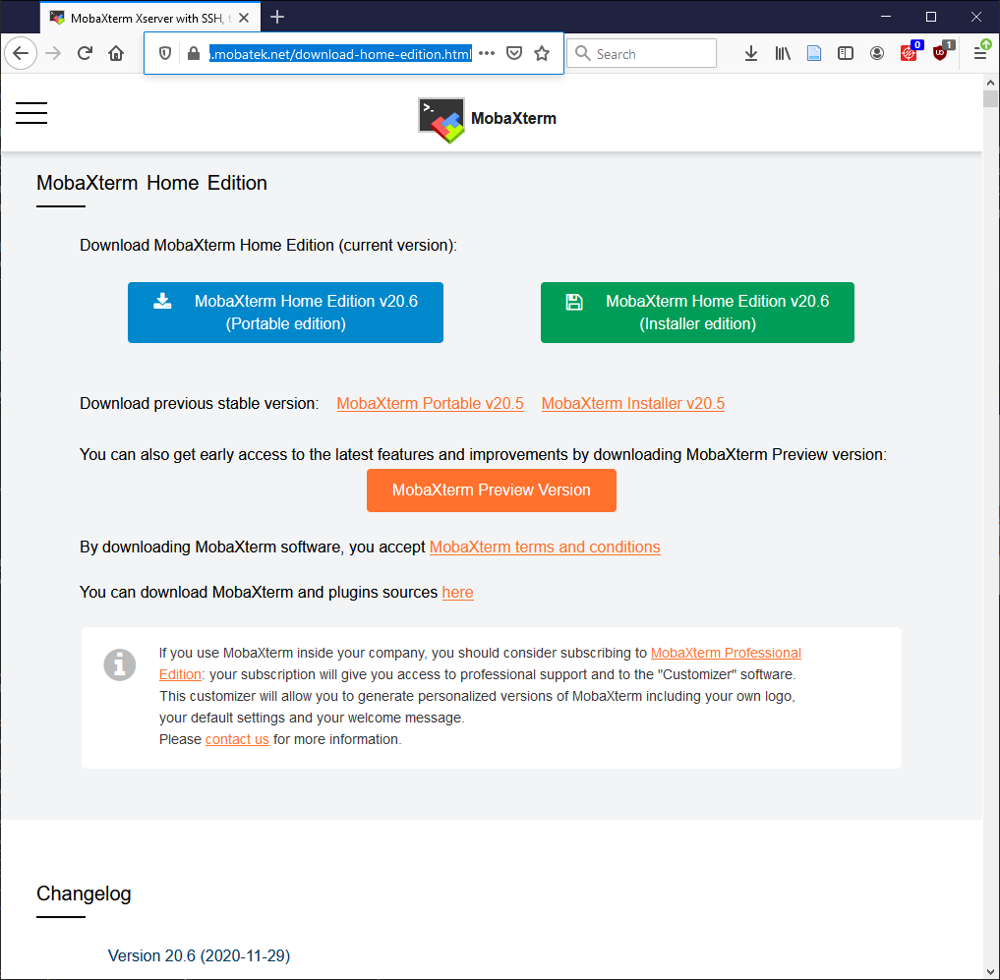

2. Click on the green `MobaXterm Home Edition v20.6 (Installer edition)` on the right (the version number might be different).
3. Once it's downloaded, double click on the zip file (mine was in Downloads and was called `MobaXterm_Installer_v20.6.zip`) and extract the contents somewhere (you can't just double click on the installer in the zip, I tried!). You can click on the `Extract All` button to extract both files:
    
    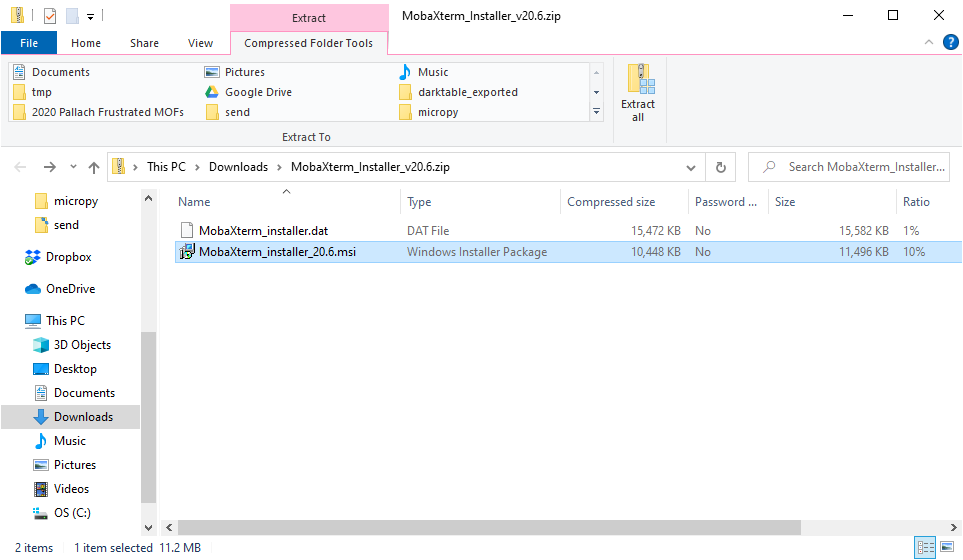

    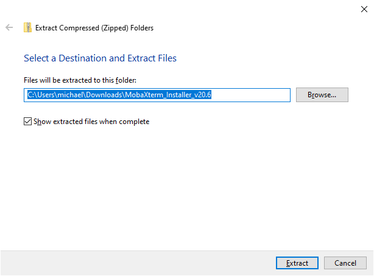

4. If you ticked the `Show extracted files when complete` checkbox in the Extract All prompt, a new Explorer window opens with the two files in it. Otherwise find where you extracted the files to.
5. Double click on the installer, `MobaXterm_Installer_v20.6.msi` and follow the prompts in the install wizard:
    - Accept the license. You need to check the checkbox:

        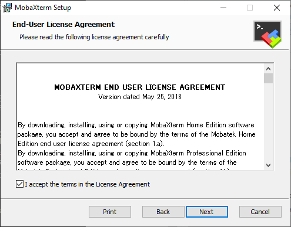

    - Confirm the path to install node - the default of `C:\Program Files (x86)\Mobatek\MobaXterm\` is good:

        

6. Finally, click on the Install button. You may be asked if you are sure you want to run the installer (yes, you do want to!)
7. At the end of the install, just click finish:

    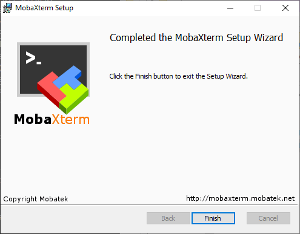

### Set-Up a Serial Connection to the ESP32 in MobaXterm
1. Plug the USB cable into the microUSB port on the ESP32. Connect the other end to a free USB port on your laptop.
2. Open MobaXterm from the Start Menu.
3. Once it starts up (be patient, this can take a while on the first go!) you get a window that looks a bit like this:

    

4. Click on the *Session* button in the top left corner of the screen.
5. In the *Session Settings* window, select *Serial*:

    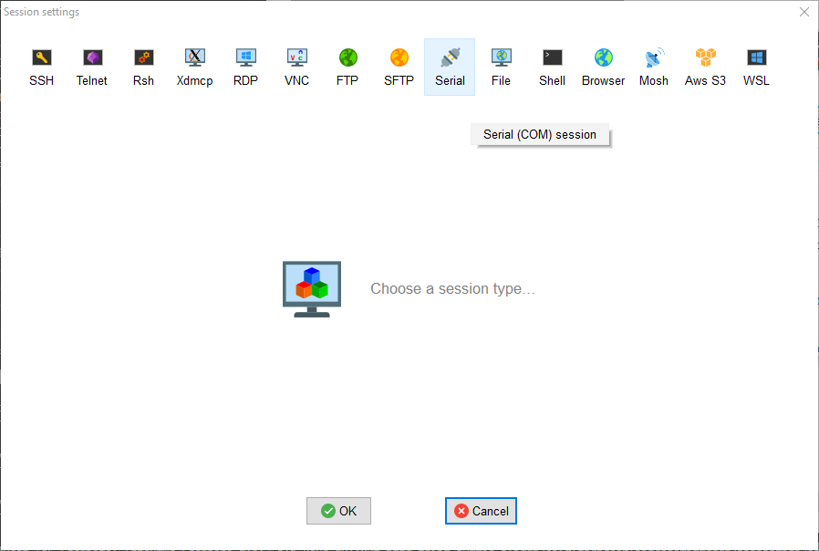

6. From the "Serial Port *" drop-down menu, choose the option with "Silicon Labs CP210x USB to UART Bridge" in the name. The number after COM is more than likely different to the one in the picture, but that doesn't matter:

    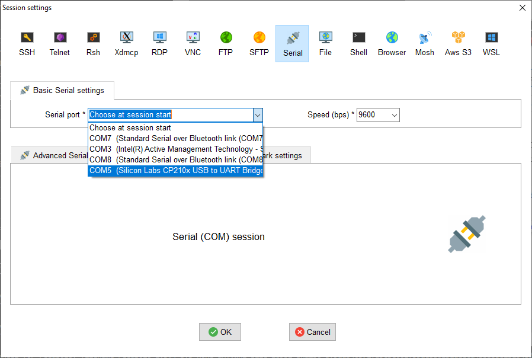

7. From the "Speed (bps) \*" drop-down menu, choose 115200. This is the *baud rate* (a la old fashioned Modems!) and needs to be set to the same value as configured on the other end otherwise you will get gibberish on the screen. The ESP32 comes configured with a baud rate of 115200 bits per second (bps) by default:

    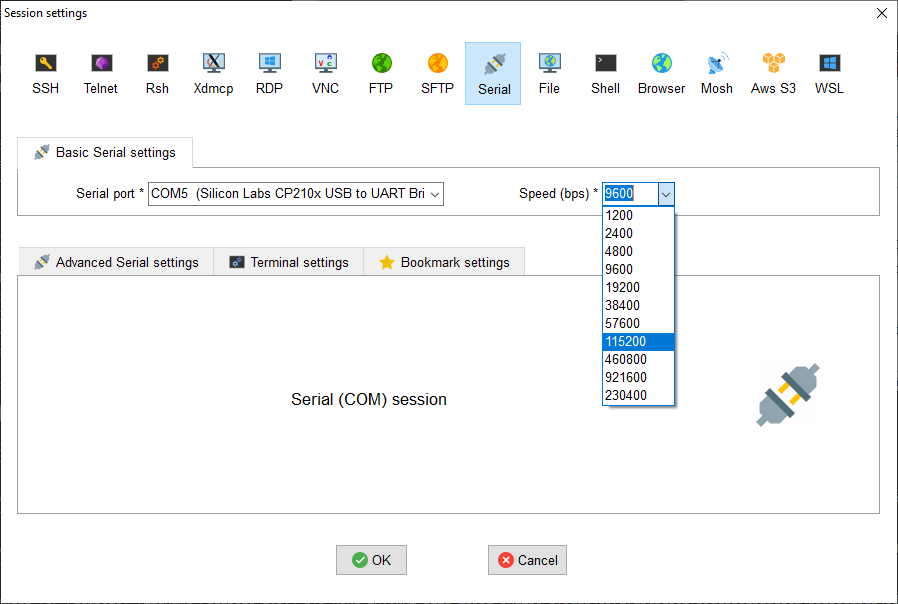

8. Finally click OK. You are returned to the MobaXterm window and a whole load of text should scroll down the black part of the window.

    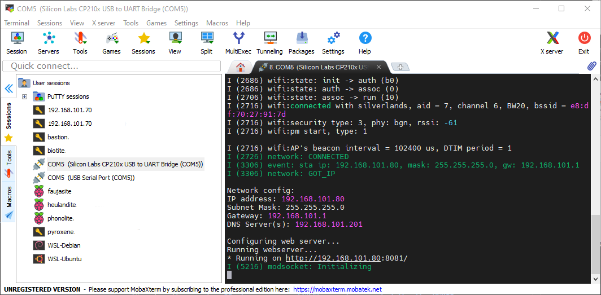
    
    We want to get to the Micropython prompt, but something else is currently running (we'll find out what's running later...). To stop the running program, press &#60;Ctrl&#62;+C.
    
    Finally you are left with the `>>>` prompt. This is the REPL and you can enter python code in here to test things out:
    
    You can check everything is working by entering the following code:
    ```python
    >>> import sys
    >>> sys.version_info
    ```
    Pressing return on that last line should return `(3, 4, 0)`
    
    - If no text appears on the screen and there is no `>>>` shown, but no error is shown either, try pressing &#60;Ctrl&#62;+C to stop the running program.

9. On the left hand side of the MobaXterm screen you should see a new option under *User sessions*. In my case it's labelled: `COM5 (Silicon Labs CP210x USB to UART Bridge (COM5))`. Next time you start MobaXterm (with the ESP32 connected), you can simply double click on this line to start the REPL.

## Setup VSCode <a id="setup-vscode"></a>
*This next section is a bit more advanced and we don't need it for the first part, messing about with LEDs.*

To allow us to write python code and upload it onto the ESP32, we are going to install the [PyMakr](https://docs.pycom.io/gettingstarted/software/vscode/) VSCode extension. PyMakr needs [Node.js](https://nodejs.org/) installed on the computer to run, so we'll install that first...
For the minute, **make sure your ESP32 is not connected the the USB**.

### Install Node.js
1. Download Node.js from [https://nodejs.org/] - as of 05.12.2020, the current Long-Term Support (LTS) version, 14.15. Click the link on the left of the Node.js homepage:

    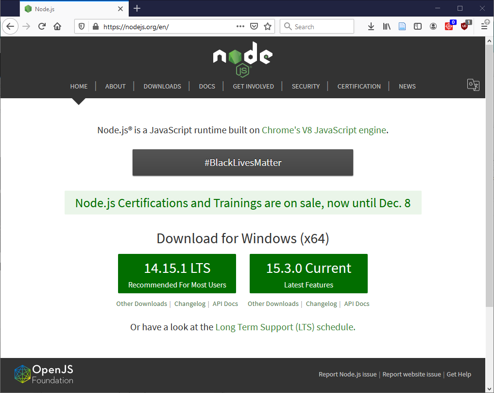

2. Once it's downloaded, double click on the installer (mine was in Downloads and was called `node-v14.15.1-x64.msi`)
3. Follow the prompts in the install wizard:
    - Accept the license. You need to check the checkbox:

        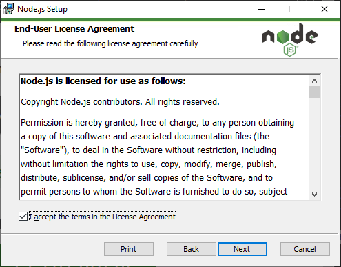
    
    - Confirm the path to install node - the default of `C:\Program Files\nodejs` is good:

        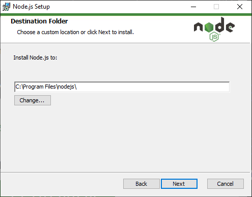
    
    - Confirm the install options. Again the default is fine:

        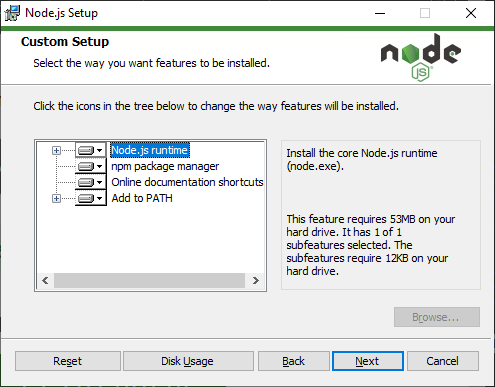
    
    - The install asks if you want to install any additional tools. I decided not to, as I don't think we need them. If it turns out we do, then there is a link to instructions on how to install them: https://github.com/nodejs/node-gyp#on-windows

        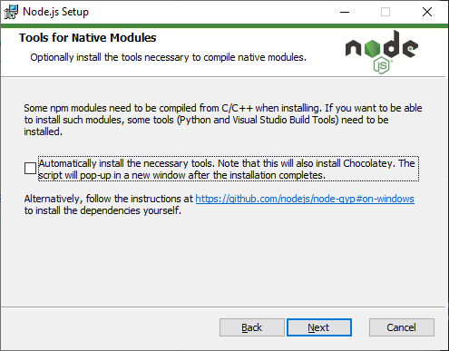
    
        If, on the other hand, you do think it would be a good idea to install them, then please go ahead
4. Finally, click on the Install button. You may be asked if you are sure you want to run the installer (yes, you do want to!)
5. At the end of the install, just click finish:

    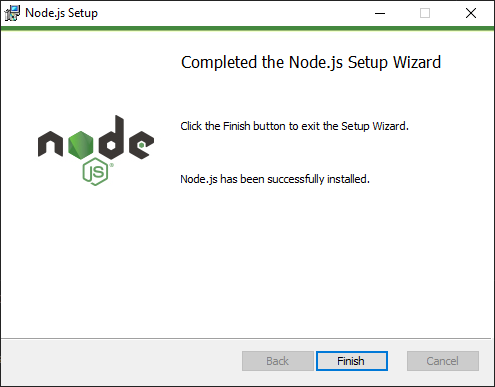

### Install PyMakr Extension
1. Open VSCode and from the File menu choose *New Window*:

    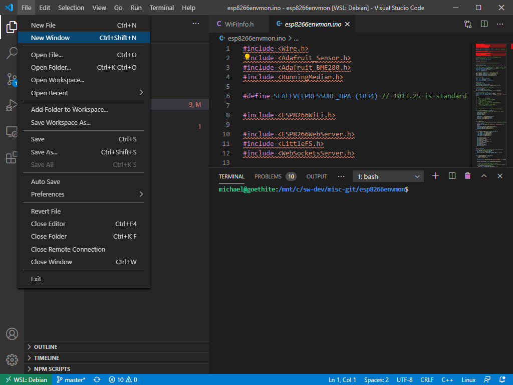

2. Click on the *Extensions* button, probably at the bottom of the set of icons on the far left of the screen. This will open up the extension manager:

    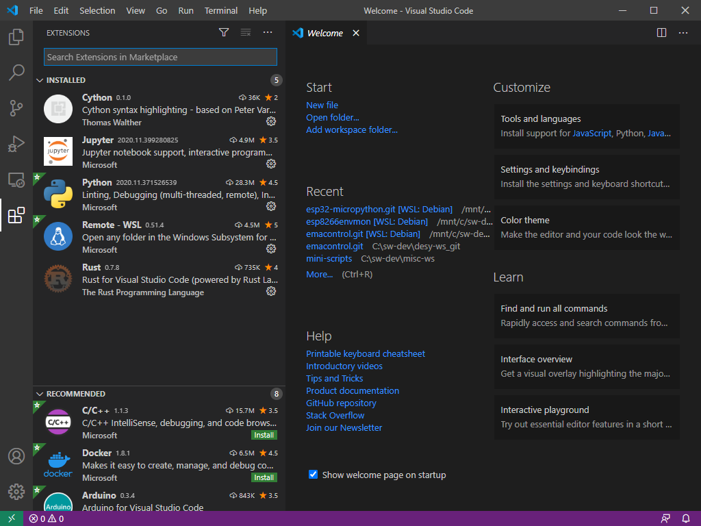

3. At the top of the left hand column of the screen there is a search box. Type in here *pymakr* to search for the PyMakr extension:

    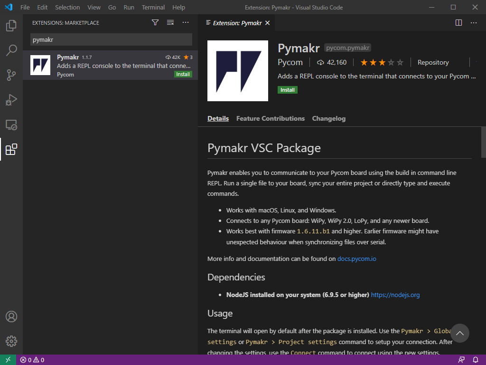

4. Click on the PyMakr extension listed in the search to get the same view as in the screen shot. To install, click on either of the green *Install* buttons (there's one in the search and one in the main part of the window).
    - After clicking on *Install*, the button goes blue and reads *Installing*. Wait until the text changes again to *Uninstall*. At this point PyMakr is installed.
5. After a few moments the VSCode shows the pymakr.json file, which contains the configuration for the extension:

    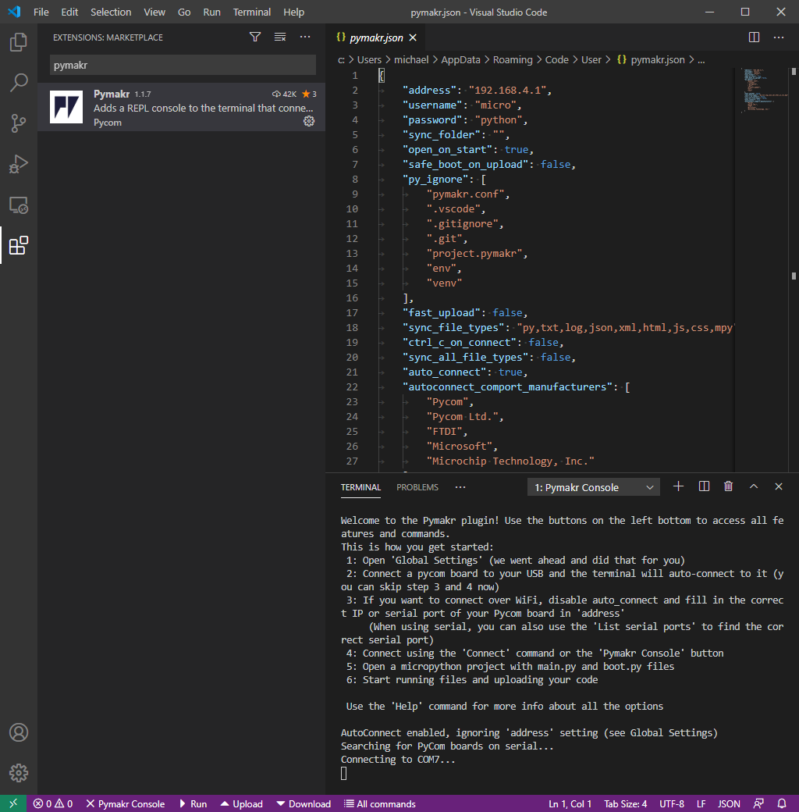

6. Towards the bottom of the file there is a line which reads `"autoconnect_comport_manufacturers": [` followed by a list of names. This is the list of device manufacturers which PyMakr will connect to (actually it's the manufacturer of the Serial port hardware). If you remember from setting up MobaXterm, our ESP32 had the name "Silicon Labs CP210x USB to UART Bridge". We need to add "Silicon Labs" to the list. To do this:
    - Find the last name in the list (mine was `"Microchip Technology, Inc."`) and add a comma to the end of this line: `"Microchip Technology, Inc.",`
    - Add a new line which reads `"Silicon Labs"`. Note this doesn't need a comma.
    - The following line should have only a `]` in it, as it did ub the original file.
    - By default the `"autoconnect_comport_manufacturers"` includes an line for `"Microsoft",`. This caused problems connecting to the board for me, so I would remove it.

    My complete `"autoconnect_comport_manufacturers"` entry:
      ```json
      "autoconnect_comport_manufacturers": [
          "Pycom",
          "Pycom Ltd.",
          "FTDI",
          "Microchip Technology, Inc.",
          "Silicon Labs"
      ]
      ```
7. Save the file (Ctrl+s or select save from the the file menu). As a brief aside (in case you close the file, it's saved in `%APPDATA%\Code\User\pymakr.json`, i.e. <a id="pymakr-json-loc"></a>`C:\Users\kate\AppData\Roaming\Code\User\pymakr.json`)
8. In the terminal at the bottom of the screen you may see something like *Connecting to COM7...* or it may say something failed or there's an error. This isn't surprising - your board isn't connected.

    You should also notice there are new options in the bar at the bottom of the VSCode window there are some new options:
    - &#x2715; PyMakr Console
    - &#x25B6; Run
    - &#x25B4; Upload
    - &#x25BE; Download
    - All Commands

    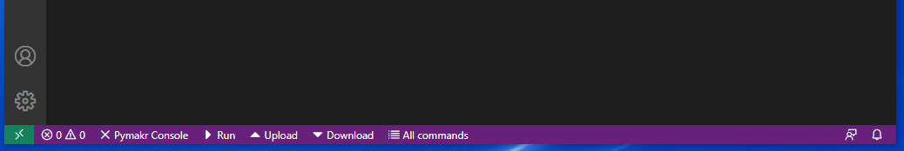

9. Plug in the ESP32 to a USB port and click on the *&#x2715; PyMakr Console* button in the status bar a the bottom. The terminal probably print something like *Connecting to COM5...* followed by the `>>>` REPL prompt indicator. If you don't see a `>>>`, try pressing &#60;Ctrl&#62;+C:

    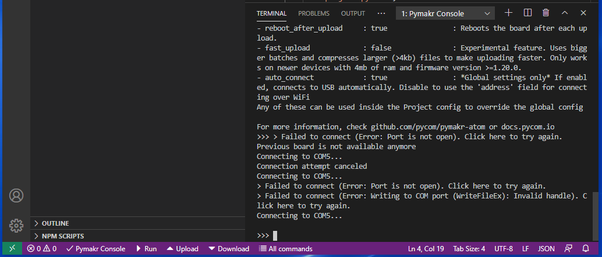
    
    At this point you can just type python commands in to the REPL as you could through MobaXterm:
    - You can check everything is working by entering the following code:
        ```python
        >>> import sys
        >>> sys.version_info
        ```
      Pressing return on that last line should return `(3, 4, 0)`

One thing I found annoying is that whenever you open a new VSCode window, PyMakr automatically tries to open a terminal. But what if we don't want to do anything with PyMakr?!

There's a setting in `pymakr.json` to disable the automatic starting of the PyMakr console (the options in the bar at the bottom of the VSCode window will still be there):
1. In `pymakr.json` (if you closed it, see [above for the file location](#pymakr-json-loc)), find the line `"open_on_start": false,`
2. Change `false` to `true`, so the line reads:
    ```json
    "open_on_start": true,
    ```
    (N.B. don't delete the comma at the end of the line!)
3. Save the file. Now next time you open VSCode, you won't get a PyMakr console until you click on the *&#x2715; PyMakr Console* button.

### Troubleshooting
I found that sometimes when you click on the *&#x2715; PyMakr Console* button, even with the ESP32 connected, PyMakr apparently fails to connect to the board. If this happens first try pressing &#60;Ctrl&#62;+C (it might be something is running already). If there is still no `>>>` prompt shown and no error, unplug the board from the USB port and plug it back in. Click the *&#x2715; PyMakr Console* button again and you should then get to the REPL prompt (well, you may well have to press &#60;Ctrl&#62;+C to stop the running program first!).
- You can only have one window with a connection to the board at any one time (i.e. one VSCode or MobaXterm). If you have another window connected (even if it's another program) you will not be able to connect. You need to close that connection (for example by closing the window) before you can connect a new window.
