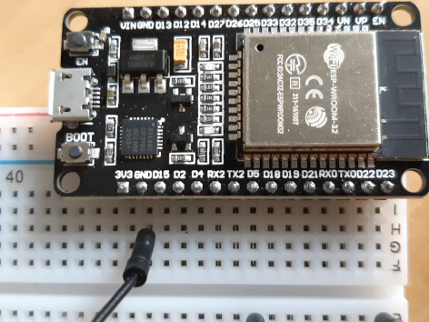
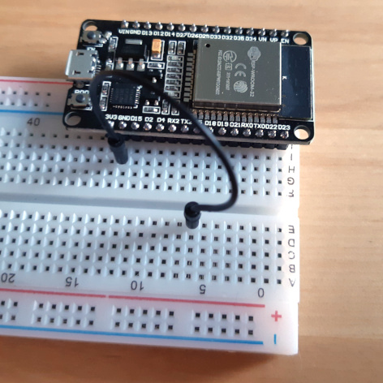
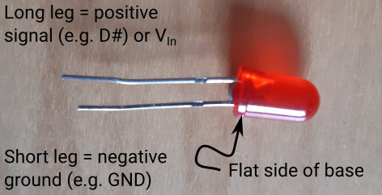
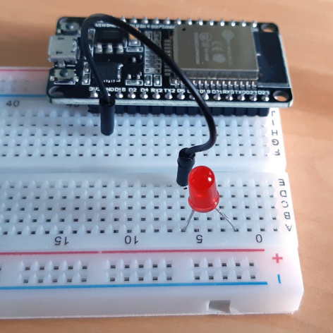
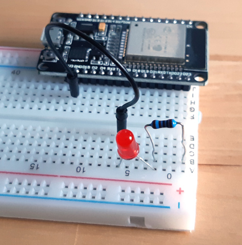
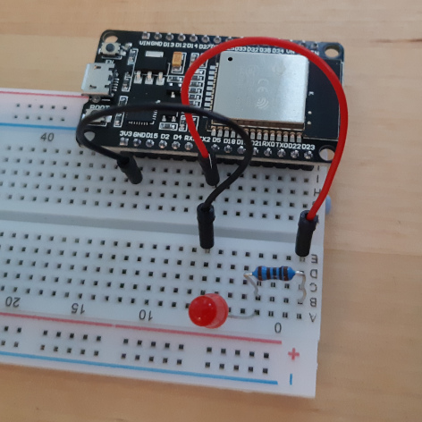
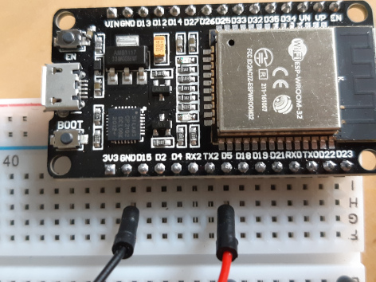
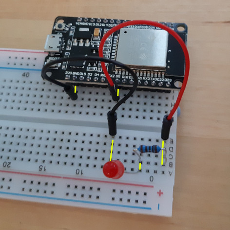

# A Simple Circuit or: what can we do from the REPL prompt?
Essentially you can do anything you would otherwise do in normal python code! It's just that it's easier to interact with the hardware with MicroPython Let's try controlling an LED...


## Controlling an LED from the REPL Prompt
Before you begin, disconnect the ESP32 from the computer from the USB port. It's worth looking through the [getting started](./getting_started.md) to make sure everything is clear first. 

For this simple setup, you will need:
- the breadboard
- an LED
- a resistor (at least 220 Ohm)
- two connecting wires

1. Push the pins on the side of the ESP32 that has the the pin nearest the USB connector labelled *3V3* into the holes on the breadboard. (**Not two separate outermost rows of holes!**)
2. Next to the *3v3* pin there is one labelled *GND* (*GrouND*). Put one of the connecting wires into the a hole on the breadboard in the same row as this. The other connect the other end of this wire to a hole on the other side of the groove in the middle of the bread board:

    
    
    - It's **important** that only the two wires go across the middle groove. Do not connect any of the other components over the groove!
    
        

The two legs of the LED are different lengths. The shorter of these should be connected to the ground (negative) and the longer should be connected to the supply voltage (positive).
- I remember this by thinking of the negative symbol being made of one bar (-) whereas the positive symbol is made of two (+ = --), which when laid out next to each other makes a longer bar.

    

3. Push the shorter leg of the LED into a hole in the board in the same row as you plugged in the wire from the *GND*. Put the other leg into a hole in a different row.

    

4. Bend the legs on the resistor so that the whole thing makes a U-shape and push one of the legs into a hole on the same row as the longer LED leg. Choose a hole in a third different row for the other leg of the resistor (it doesn't matter which way round the resistor is connected). 

    

5. Take your second wire and connect one end to a hole in the same row as the unconnected leg of the resistor. The other end of the wire should be connected into a a hole in the same row as the *D5* pin on the ESP32, on the same side of the middle groove as the ESP32. Pin *D5* is the 8th pin along the side of the board from the *3V3* pin.

    

    And here's a close-up of the connections at the ESP-32:

    

    The next picture shows the complete electrical circuit. The yellow lines indicate where the current flows. The important thing here is that the current flows only along the rows (short direction):

    
    
    If it doesn't work in the next step:
    - check the component leads are in the same rows.
    - check the components in the same row are not on opposite sides of the middle groove.
    - check the LED is the right way round.

The electrical circuit is now complete. Let's connect up the ESP32 to the computer and do something with the LED.

## At the REPL Prompt
1. Plug in the ESP32 to a USB port on the computer.
2. Open the REPL prompt either in MobaXterm or in VSCode (see the [setup guide](./setup.md) for an explanation of how to do this).
3. After you've pressed &#60;Ctrl&#62;+C to stop the running program, type the following into the prompt:
    ```python
    >>> import machine
    >>> pin = machine.Pin(5, machine.Pin.OUT)
    >>> pin.on()
    >>> pin.off() 
    ```
    What happened to the LED when you ran the last two commands?

What's going on here?
- `import machine` imports a library which gives access to the pins as well as other hardware on the board
- `pin = machine.Pin(5, machine.Pin.OUT)` creates a variable called `pin` which is an instance of a physical `Pin` on the board. 
    - In this case it's pin 5 (from the number `5` in the arguments). If you had wired your LED up to pin 2 for instance, we would have passed a `2` instead.
    - The pin is an output pin, set by the argument `machine.Pin.OUT`, which means it will send an electrical signal out (as opposed to listening for one).
- `pin.on()` and `pin.off()` simply set whether the pin it set to a digital on state (value = 1) or off state (value = 0), which we can see as the LED being lit or not.

We can find out what state the pin is in by asking it:
```python
>>> pin.off()
>>> pin.value()
0
>>> pin.on()
>>> pin.value()
1
>>> pin.value(0)
>>> pin.value(1)
```
In the last two lines, you can see that we can also send an argument to the pin with the `pin.value()` command.

### Quick Aside...
Ever since you first plugged in the ESP32, you have had to hit &#60;Ctrl&#62;+C to get access to the REPL. The program that is running is actually a webserver which is set up to switched the LED on and off at the push of a button on the webpage. To access the webserver, we need to get the IP address of the ESP32. We also need to make sure the webserver is running. To do this.

1. Unplug the ESP32 from the USB port and plug it back in again.
2. Make a serial connection to the ESP32 (using MobaXterm or Pymakr).
3. **DO NOT PRESS &#60;Ctrl&#62;+C!**

    When the connection starts (certainly in MobaXterm) the first time after the ESP32 boots, a whole load of text is shown on the screen:
    
4. Towards the bottom of this output, you can see a section starting `Network config:`, with the first item in that section `IP address:`
    - in the example screenshot, this is 192.168.101.80, but yours will be different.
5. Type this IP address into your your web browser including the `http://` at the beginning (e.g. I would type `http://192.168.101.80`; you need to use your own IP address, this one will not work). You will see a web page with two buttons in the top left corner. Assuming your LED is wired up to pin D5 as the instructions described, when you click the "LED On" button, the LED lights; conversely "LED Off" switches off the LED.

The code that makes this all work is very simple! If you have a look in the [led_webserver](../led_webserver) directory, there's a copy of the files which are on your ESP32:
- The file `boot.py` is called automatically at startup and sets up the network using `net.py`; it also prints the network configuration.
- The file `main.py` is then automatically called. The comments in the file explain what is happening.
- The webserver ([picoweb](https://github.com/pfalcon/picoweb)) is actually only serving the same page over and over again (it's in the html directory - also copied to the ESP32 - called [ledcontrol.html](../led_webserver/html/ledcontrol.html))

To upload code to the ESP32 like this we have to have VSCode set up and the Pymakr extension loaded in it - you can see how to do this in the [VSCode setup instructions](./setup.md#setup-vscode) and there are further instructions on the [project page](./project.md).

## Making the LED Blink
Making an LED blink is pretty straight-forward. All we need to do is to turn it on and off and on and off and on and... For that you need a loop:
- with a for-loop, you can switch the LED on and off a defined number of times
- with a while-loop you can switch the LED on and off until some statement becomes false, or indeed you could just say `while True:...` and run an infinite loop.

As well as the loop, we'll want the LED to remain on or off for a certain amount of time, otherwise we won't actually see it change. For that well use the `sleep` function of the python `time` module of the standard library. You can think of `time.sleep` as a way to pause running code for a defined number of second. The function takes one argument which is an integer, the number of seconds to sleep for.

Here's an example of an infinite while-loop, which blinks the LED on and off every 2 seconds:
```python
>>> import machine
>>> pin = machine.Pin(5, machine.Pin.OUT)
>>> import time
>>> while True:
...     pin.on()
...     time.sleep(2)
...     pin.off()
...     time.sleep(2)

```
- After the last `time.sleep(2)` you can either press return four times or you can press return once, backspace (to remove the indentation) and return again. Either way works, it's just the REPL's way of coping with the indentation.
- As this is a `while True:...` the LED will now keep blinking. Forever. To stop it blinking, in the REPL console, press &#60;Ctrl&#62;+C on the keybaord together. You'll get a message like:
    ```python
    Traceback (most recent call last):
    File "<stdin>", line 3, in <module>
    KeyboardInterrupt:
    >>> 
    ```
    Which looks a bit worrying, but it actually fine. At this point you can just type in code again as you have been.
- Why do we need the second `time.sleep(2)`? Why not try putting in the same loop above, without the second call to sleep...

    What happened? You don't see any flashing. Because the LED goes straight from the off-state back to the on-state, sleeps for 2 seconds; this is then repeated.

### What next?
- You could try writing this as a for-loop.
- Or you could change the time for the sleeps - they don't need to be the same!
- You could put the whole lot into a function, so you can call it. If you had a for-loop, you could have the number of repeats as an argument and the sleep time as a second argument.
- Why not wire up a second LED? Connect the short leg of the LED to the same ground as the first (put it in the same row); the other leg should go in a different row to the long leg of the first LED. Connect the long leg to a second resistor and then that resistor can be connected with a wire to a different pin on the ESP32 (D18 is next to D5, you could use that).

    When you set up the second LED in python you'll need to use a different variable name and a different pin number (the same as the one you physically connected):
    ```python
    >>> import machine
    >>> led_1 = machine.Pin(5, machine.Pin.OUT)  # Connected to D5
    >>> led_2 = machine.Pin(18, machine.Pin.OUT) # Connected to D18
    >>> led_1.on()  # Switch on LED connected to D5
    >>> led_2.on()  # Switch on LED connected to D18
    ```
    You can now make these blink alternately, just by adding a couple of extra lines to the loops you've already written.

- If you now add a third LED, let's say we've now got red, yellow and green, you could write a function to mimic a set the traffic lights...

## Making the LED Fade (PWM)
*This is work in progress*
```python
>>> import machine
>>> pin = machine.Pin(5, machine.Pin.OUT)
>>> pinpwm = machine.PWM(pin)
>>> pinpwm.duty(0)     # Switches LED off
>>> pinpwm.duty(1023)  # Switches LED on
```


