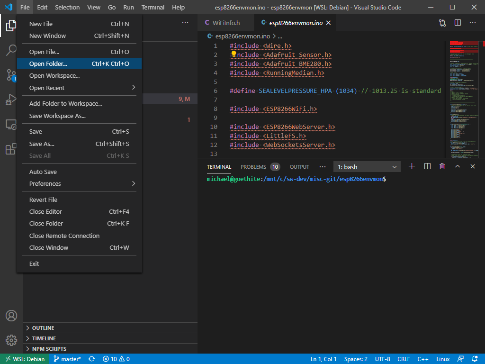
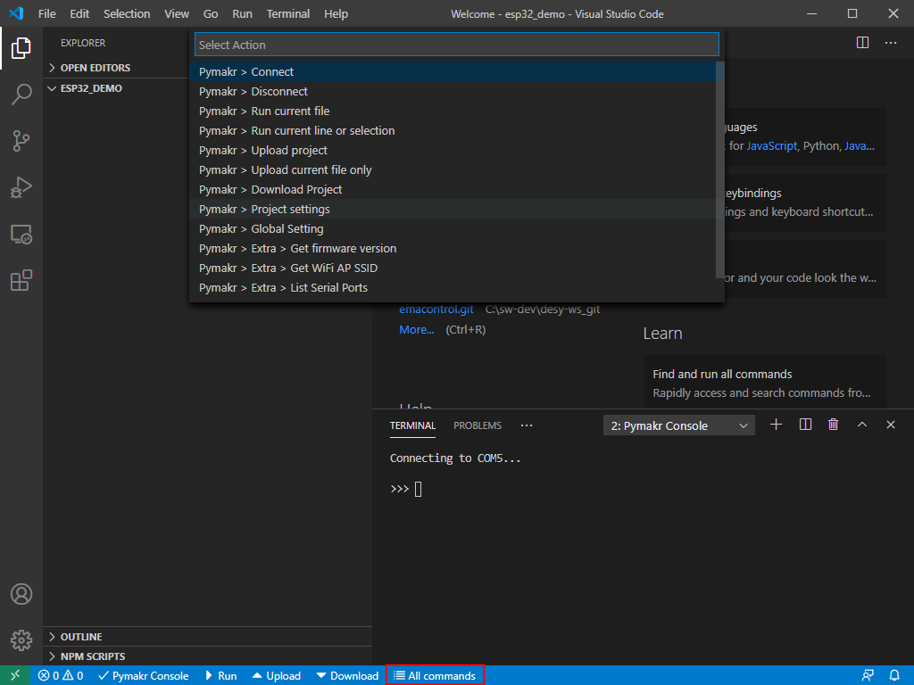
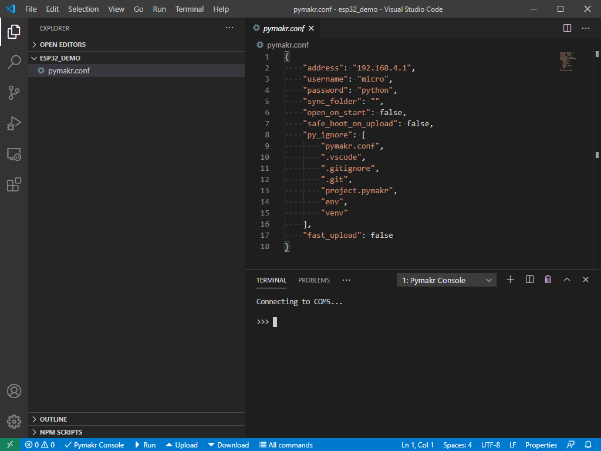
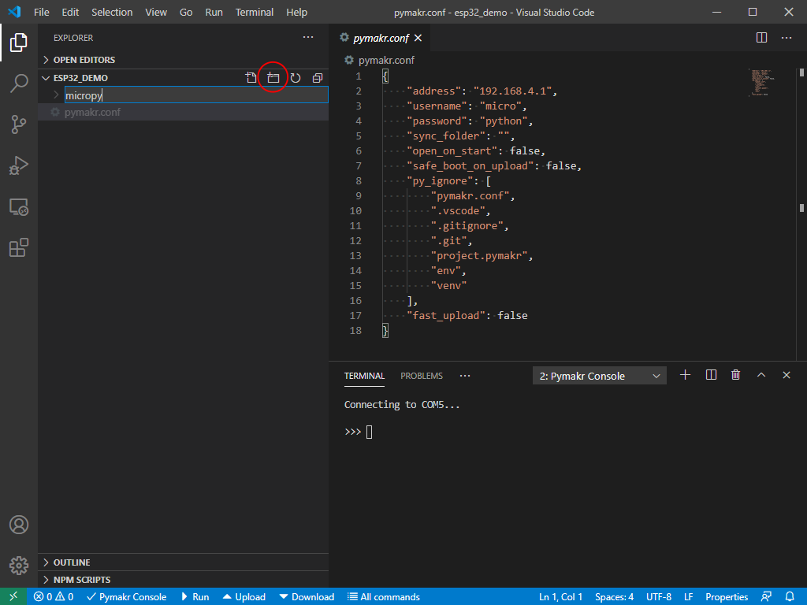
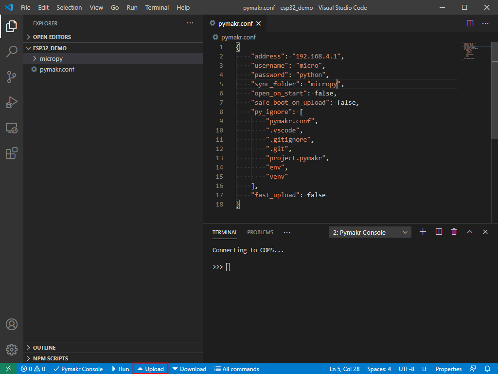

# Writing Programs to Run on ESP32 Micropython
This guide assumes VSCode is installed with the PyMakr Extension. Details of how to do this are in the [setup instructions](./setup.md#setup-vscode).

1. Create a new directory where you are going to save your code.
2. In VSCode, open this directory by using the *Open Folder* option in the file menu:

3. If you haven't already, plug in the ESP32 to a free USB port. Check it's properly connected and you can get to a REPL prompt by clicking on the *&#x2715; PyMakr Console* button.

As well as the global settings for PyMakr we edited in the `pymakr.json` file as part of the setup guide, each project can also have its own custom settings, which may override the global ones. These are stored in a file called `pymakr.conf` in the project directory.

4. Click on the *All Commands* button in the status bar at the bottom of the VSCode window (highlighted in the picture). This opens the PyMakr options menu:

5. From the menu select *Pymakr > Project settings*. This creates the `pymakr.conf` file and opens it for you:


As implied, PyMakr can upload programs to the ESP32. By default, it will upload any files which are in the project directory which have the file extensions .py, .txt, .log, .json, .xml,. html,. js,. css,. mpy (from the `"sync_file_types"` option of `pymakr.json`). To make sure we don't upload anything we didn't intend to to the ESP32, we can put all of our program's files into a specific directory and upload only that:

6. Create a directory in the project called, for example, `micropy`:

7. In the `pymakr.conf` file in open in the VSCode window, change the `"sync_folder"` option from `""` to `"micropy"` (or whatever you called the directory you just made):


Now when we click the *&#x25B4; Upload* button (highlighted in the previous screenshot) at the bottom of the window, all files (with the correct file extensions) will be uploaded to the ESP32.

## 

For picoweb:
```python
>>> import upip
>>> upip.install("picoweb")
<>
>>> upip.install("pycopy-ulogging")
<>
>>> 
```
